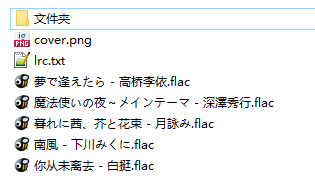
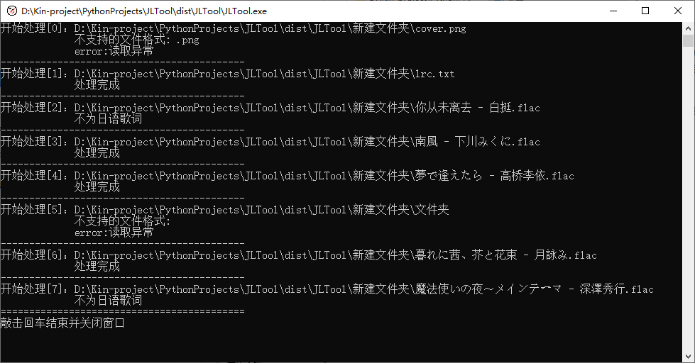
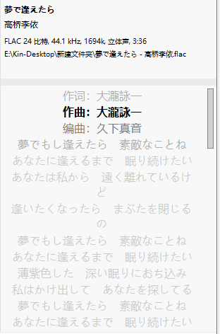
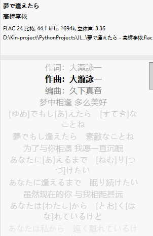
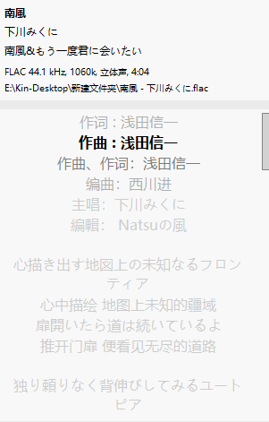
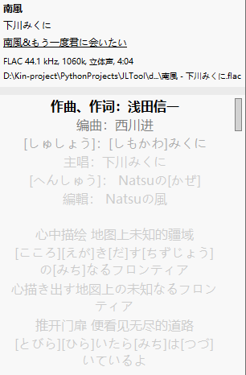
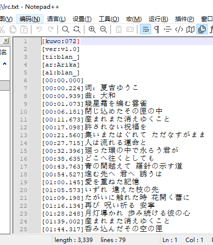
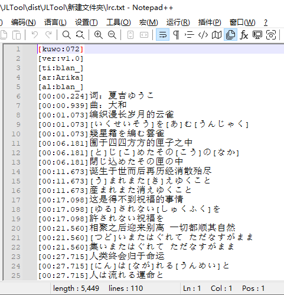

# JLTool功能介绍：  
1.对日语歌词进行注音，可选假名注音和罗马音注音，可选歌词顺序  
2.支持文件类型：mp3 | flac | opus | txt | lrc  
3.注音修改会在输入的文件上进行，不可恢复，请自行备份数据  
4.该工具不能完全替代人工检查，注音功能不保证100%准确，根据情况需要人工根据日志提示进行修正    
5.可双击JLTool.exe文件启动后，点击按钮选择文件夹或文件；也可拖动文件夹或文件到JLTool.exe文件上执行  

### 作者B站： 绘星痕  
### 项目地址：  
https://github.com/Kin-L/JLTool  
https://gitee.com/huixinghen/JLTool
### Tips:  
默认设置歌词顺序为 中文-假名-日语  
如需更改请在config.json文件中修改  
对应关系如下，中间用“-”分隔：  
chin  | 中文  
hira  | 假名注音  
kanji | 日语  
roma  | 罗马音  

### 版本介绍:  
#### JLTool分为kks版本和ds版本
##### kks版本：
1、本地计算，单曲处理快速  
2、支持生成平假名和罗马音注音（通过pykakasi库），注音存在少数错误率，请自行鉴别  
3、不支持生成中文翻译；支持识别已有的中文翻译，进行顺序调整
##### ds版本：
1、需要自行在config.json中填写deepseek的api_key。  
2、调用deepseek进行中文翻译和平假名和罗马音注音，准确率较高。  
3、受限于deepseek信息返回速度，单曲处理时间长，ds版本采用了多线程方案提升每秒处理速度。  
### 结果查看 
1、JLTool根目录中，lyrics文件夹备份进行修改前的歌词文本，output文件夹记录deepseek返回信息  
2、处理的音乐文件会在处理完成后，根据情况分类在以下子文件夹下：  
success:处理成功的文件，往往不需要再次检查和更改  
defect:处理后检测到，可能存在处理缺陷的文件，需要根据命令行中的处理日志信息，进行人工判断  
error:歌词读取失败的文件  
other:检测判断为非日语歌词的文件，非同步歌词的文件等等  
### 功能预览
#### 处理的文件一览
  
#### 处理界面信息反馈
自动识别非日语歌词并跳过，并跳过不支持文件的类型  
  
#### 无翻译的歌词处理情况(歌词查看软件为musicbee)
##### 处理前后
  
#### 有翻译的歌词处理情况
##### 处理前后
  
#### 文本文件处理
##### 处理前后
  
#### 椒盐音乐界面展示
##### 处理前后

