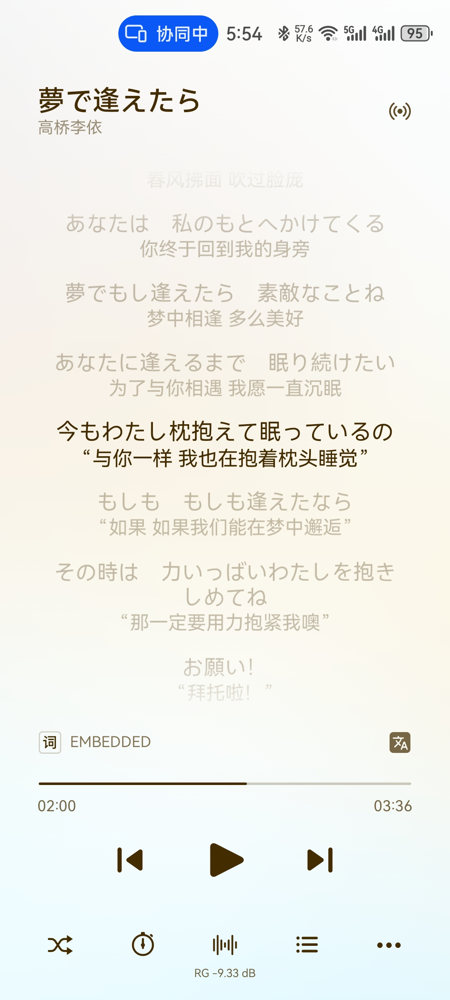

# JLTool功能介绍：  
1.对日语歌词进行注音，可选假名注音和罗马音注音，可选歌词顺序  
2.支持文件类型：mp3 | flac | opus | txt | lrc  
3.注音修改会在输入的文件上进行，不可恢复，请自行备份数据  
4.该工具不能替代人工检查，注音功能不完全准确，和修改错误的部分  
5.可双击JLTool.exe文件启动后，点击按钮选择文件夹或文件；也可拖动文件夹或文件到JLTool.exe文件上执行  
6.双击JLTool.exe文件启动并执行一次任务后会生成“config.json”设置文件，可在其中修改设置  
### 作者B站： 绘星痕  
### 项目地址：  
https://github.com/Kin-L/JLTool  
https://gitee.com/huixinghen/JLTool
### Tips:  
默认设置歌词顺序为 中文-假名-日语  
如需更改请在config.json文件中修改  
对应关系如下，中间用“-”分隔：  
chin  | 中文  
hira  | 假名注音  
kanji | 日语  
roma  | 罗马音  
### 功能预览
#### 处理的文件一览
  
#### 处理界面信息反馈
自动识别非日语歌词并跳过，并跳过不支持文件的类型  
  
#### 无翻译的歌词处理情况(歌词查看软件为musicbee)
##### 处理前后
  
#### 有翻译的歌词处理情况
##### 处理前后
  
#### 文本文件处理
##### 处理前后
  
#### 椒盐音乐界面展示
##### 处理前后

